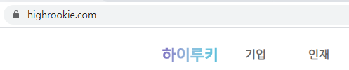
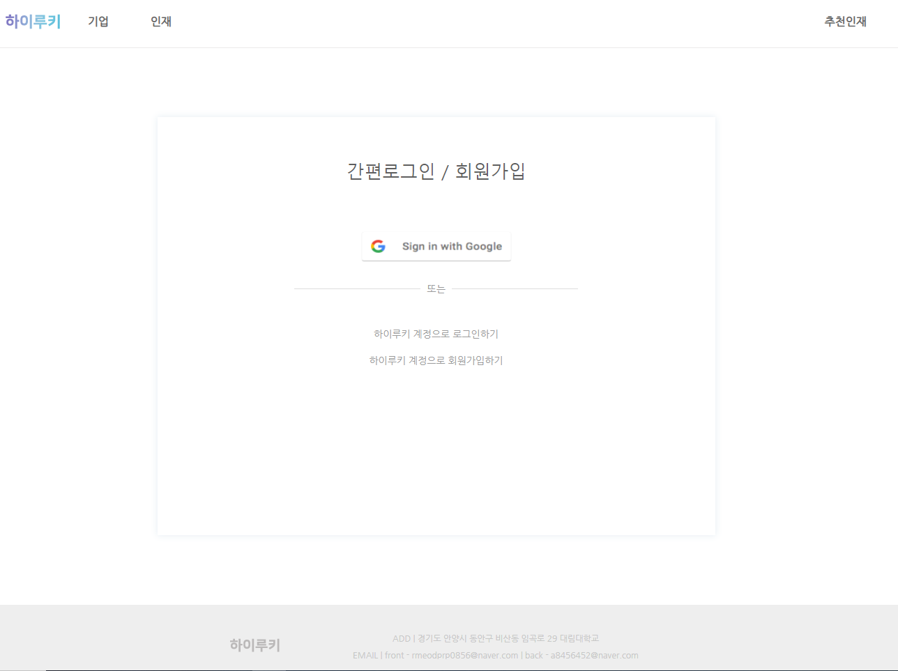
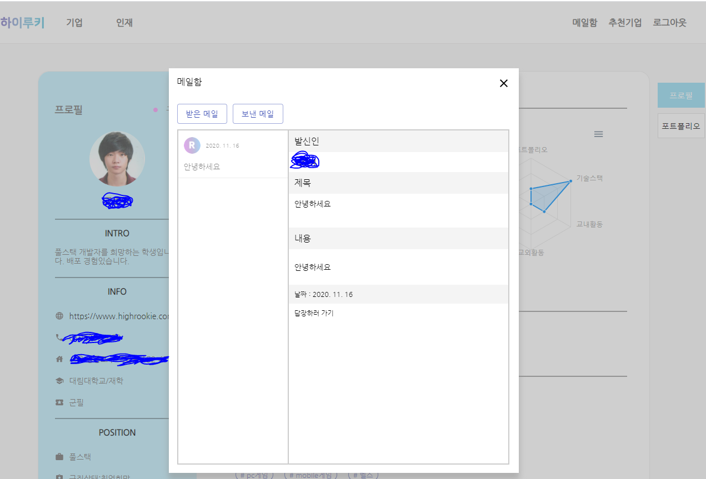
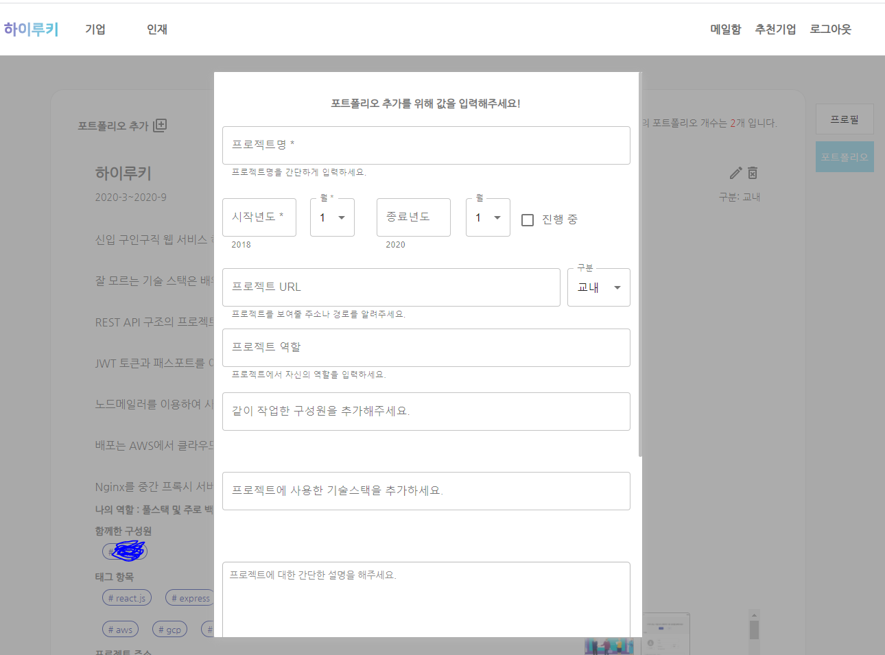
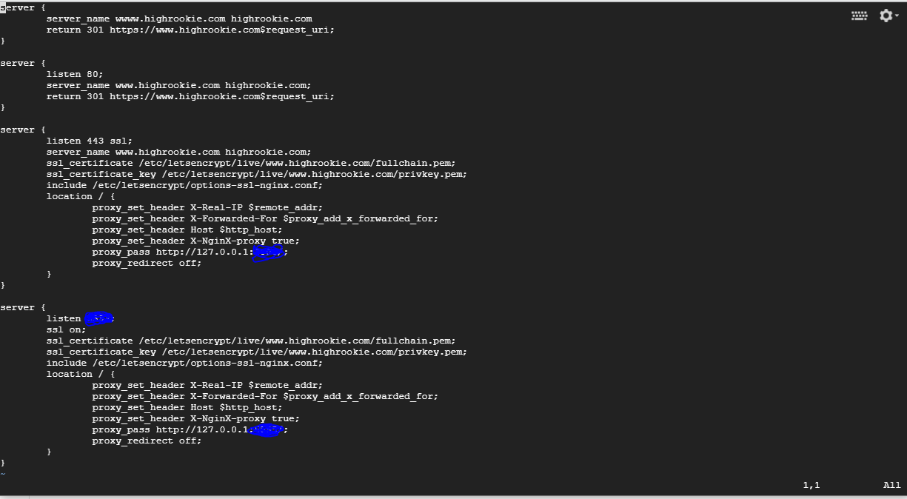

# HighRookie Project

### Jo junmyeong & Ko yuri

##### - Daelim Project -

# <<<<<<< HEAD

-   domain : 서버 다운
    > > > > > > > junmyeong
-   React-Express
-   Client-Server
-   v. 1.0 (beta)

## HighRookie Project란 ? ( beta )

경력없는 신입들만을 위한 신입 구직구직 웹 서비스 입니다.

베타 버전으로, 대림대학교 모바일인터넷과 학생만을 수용합니다.

### 기술 스택

```js
-CLIENT-
React.js
React-Router-Dom
Material UI
Apexcharts Graph
Firebase-Storage => File Upload/Save

-SERVER-
Node.js - Express
REST API
Sequelize ORM
Mysql           => Database
Axios
JWT             => Session
Nodemailer      => Email Auth
Passport        => Google
Pm2

-TOOLS-
VsCode
Workvench
Zeplin
Postman
Sourcetree

-Cloud-
Aws Educate -> GCP
Nginx
Lets Encrypt SSL
client => pm2 ( /build ) ( serve )
server => pm2 ( --env production )
```

### 흐름도

```
Insert or oAuth -> Login ->
basic Info Set -> Profile Confirm -> Board or Recommend Popup
```

### 부족한 사항

-   모바일 반응형 페이지 ( 마이페이지 ) 부족.

---

도메인에 Https 적용 ( Lets Encrypt )  


메인페이지  


소셜 로그인 ( 구글 )  


메일함과 포트폴리오 관리 페이지  
  


Nginx & SSL  

